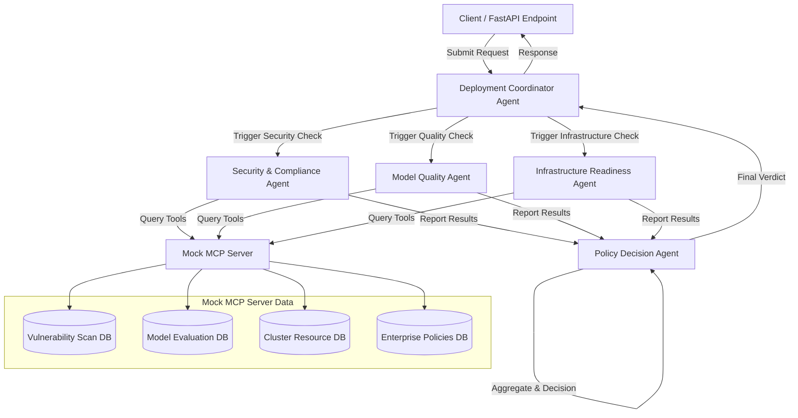

# Implementation Plan - AI Platform Deployment Agent

This plan outlines the architecture, design, directory layout, and synthetic dataset requirements for the **AI Platform Deployment Agent** capstone project. The system simulates a hybrid cloud AI platform governance system validating model deployment requests before GKE-style Kubernetes cluster deployment.

---

## Architecture Overview



### Components

1. **FastAPI Web Service**: 
   - Exposes REST endpoints to submit model deployment requests.
   - Provides status tracking and displays JSON logs/verdicts.
2. **ADK Multi-Agent System**:
   - **DeploymentCoordinatorAgent**: Coordinates the evaluation workflow by routing the deployment request to the evaluation agents and retrieving the final verdict from the Policy Decision Agent.
   - **SecurityComplianceAgent**: Evaluates container vulnerabilities and verifies compliance against enterprise security policies.
   - **ModelQualityAgent**: Validates evaluation metrics, bias detection reports, and checks if thresholds meet production requirements.
   - **InfrastructureReadinessAgent**: Assesses GKE-style Kubernetes cluster resource capacity (CPU, GPU, RAM), verifies logging/monitoring configurations, and checks rollback options.
   - **PolicyDecisionAgent**: Aggregates the findings/outputs from `SecurityComplianceAgent`, `ModelQualityAgent`, and `InfrastructureReadinessAgent`, applies decision criteria, and produces the final verdict (`APPROVED`, `APPROVED WITH WARNINGS`, or `BLOCKED`).
3. **Mock MCP (Model Context Protocol) Server**:
   - Exposes standardized tools to let agents query simulated environment state:
     - `get_container_vulnerabilities(image_uri)`
     - `get_model_metrics(model_id)`
     - `get_cluster_status(cluster_name)`
     - `get_policy_rules(namespace)`
4. **Antigravity / ADK Agent Skills**:
   - Refers to skills installed/packaged via `google-agents-cli` (ADK skills).
   - Reusable checking utilities implemented in Python reside under `src/skills/` as local helpers, distinct from `google-agents-cli` formal skill configurations.

---

## Directory Structure

We will set up the project under the root workspace as follows:

```text
capstone-project/
├── .gitignore
├── pyproject.toml                 # uv package definition and dependencies
├── README.md                      # General documentation
├── config/                        # Global configuration files
│   └── agent_config.yaml          # Agent behavior and threshold settings
├── data/                          # Synthetic Enterprise Platform Data
│   ├── deployment_requests/       # Mock deployment request payloads
│   │   ├── req_001_standard.json  # Standard compliant request
│   │   ├── req_002_critical_cve.json # Blocked due to container vulnerabilities
│   │   └── req_003_poor_metrics.json # Warnings/Blocked due to model quality
│   ├── model_registry.json        # Mock model evaluation & quality data
│   ├── security_scans.json        # Container vulnerability scan database
│   ├── cluster_status.json        # GKE-style cluster capacity and health info
│   └── enterprise_policies.json   # OPA-like policy rules
├── src/
│   ├── __init__.py
│   ├── main.py                    # FastAPI entrypoint
│   ├── mcp_server.py              # Mock MCP server implementing tools
│   ├── agents/                    # ADK agent definitions
│   │   ├── __init__.py
│   │   ├── coordinator.py         # DeploymentCoordinatorAgent
│   │   ├── security.py            # SecurityComplianceAgent
│   │   ├── quality.py             # ModelQualityAgent
│   │   ├── infrastructure.py      # InfrastructureReadinessAgent
│   │   └── policy_decision.py     # PolicyDecisionAgent
│   ├── skills/                    # Reusable helper libraries
│   │   ├── __init__.py
│   │   ├── policy_checker.py
│   │   ├── resource_validator.py
│   │   └── quality_checker.py
│   └── utils/
│       ├── __init__.py
│       └── helpers.py
└── tests/                         # Unit and integration tests
    ├── __init__.py
    ├── test_agents.py
    └── test_mcp.py
```

---

## List of Synthetic JSON Files Needed

1. **`data/deployment_requests/req_*.json`**:
   - Schema: `request_id`, `model_name`, `model_version`, `container_image`, `target_cluster`, `namespace`, `cpu_request`, `memory_request`, `gpu_request`, `monitoring_enabled`, `rollback_strategy`.
2. **`data/model_registry.json`**:
   - Schema: Keyed by `model_id`. Contains model type, performance metrics (accuracy, F1-score, latency p95), training data drift metric, and bias evaluation indicator.
3. **`data/security_scans.json`**:
   - Schema: Keyed by `container_image`. Contains list of vulnerabilities (CVE ID, severity, package, fix status) and base OS image scan status.
4. **`data/cluster_status.json`**:
   - Schema: Keyed by `cluster_name`. Contains total vs allocated CPU, Memory, and GPU resources, health status, and configured monitoring framework.
5. **`data/enterprise_policies.json`**:
   - Schema: Minimum acceptable F1-score, maximum allowed CVE severity level, required namespace labels, allowed base container registries.

---

## Verification Plan

### Automated Tests
- Command to run unit tests: `pytest` or `python -m pytest`
- Tests will cover:
  - Mock MCP server tool responses.
  - Agent decision tree evaluations.
  - Integration of FastAPI endpoints.

### Manual Verification
- Execute FastAPI server using `uvicorn src.main:app --reload`.
- Send requests using curl/Postman to verify correct classification (`APPROVED`, `APPROVED WITH WARNINGS`, `BLOCKED`).
- Inspect logs to confirm ADK agent communication and tool execution.
